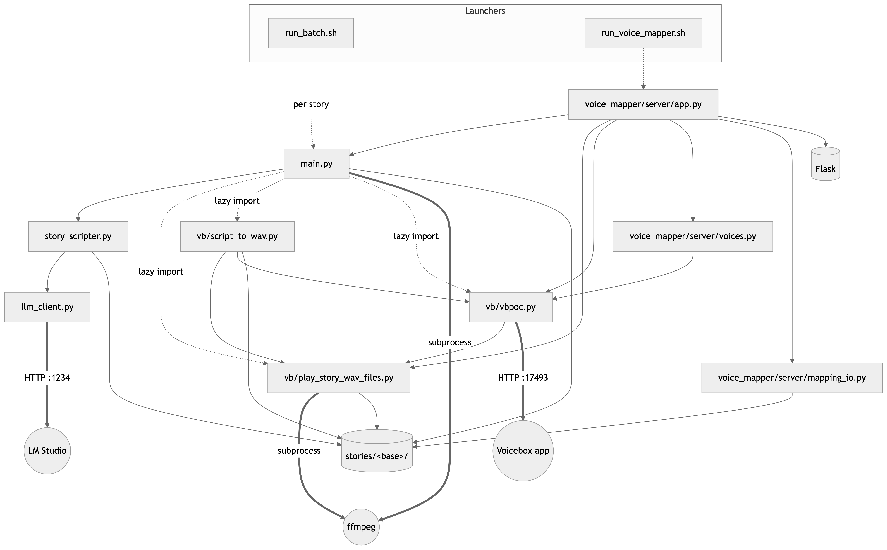
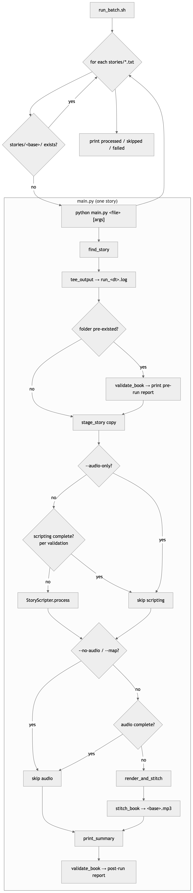
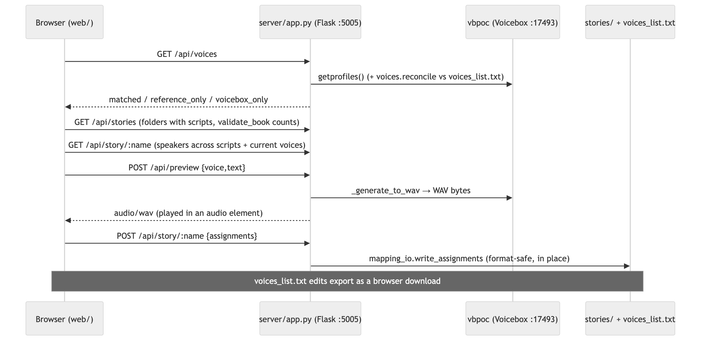

# Architecture

How StoryScripter is wired: module dependencies, the end-to-end batch flow, and
the call chains behind each stage. Pairs with [`README.md`](README.md) (usage) and
the per-package `vb/README.md` / `voice_mapper/README.md`.

## 1. Components at a glance

| Layer | Module(s) | Role | External dep |
|-------|-----------|------|--------------|
| Launchers | `run_batch.sh`, `run_voice_mapper.sh` | shell entry points | — |
| Orchestrator | `main.py` | CLI; stages, scripting, audio, validation, logging, book stitch | ffmpeg |
| Scripting | `story_scripter.py` → `llm_client.py` | split → characters → scripts → voice map | LM Studio |
| Audio client (`vb/`) | `vbpoc.py`, `script_to_wav.py`, `play_story_wav_files.py` | render WAVs, stitch MP3s, recover Voicebox | Voicebox, ffmpeg |
| Voice GUI (`voice_mapper/`) | `server/app.py`, `voices.py`, `mapping_io.py`, `web/*` | audition + assign voices | Flask, Voicebox |
| Data | `stories/<base>/…`, `voices_list.txt` | inputs/outputs on disk | — |

## 2. Module dependency graph

Solid = Python `import`; dashed = spawns/launches; dotted = network/process I/O.



<sub>*Diagram source: [`images/module-dependency-graph.mmd`](images/module-dependency-graph.mmd) — regenerate with `./images/render.sh`.*</sub>

_Plain-text rendering (for viewers without a Mermaid renderer):_

```
 LAUNCHERS    run_batch.sh                          run_voice_mapper.sh
                 | spawns: python main.py <story>        | spawns
                 v                                       v
 ORCHESTR.    main.py  ............................  voice_mapper/server/app.py
                 |  \  (lazy import vb/)                 |  imports:
                 |   \________________________          |   - main.py (validate_book)
                 v                            \         |   - vb/play_story_wav_files.py
 SCRIPTING    story_scripter.py                \        |   - vb/vbpoc.py
                 |                              v        |   - voices.py --> vb/vbpoc.py
                 v                     vb/script_to_wav.py    - mapping_io.py --> stories/
              llm_client.py             |        |           - Flask (:5005)
                 |                       |        v
                 v HTTP :1234            |   vb/vbpoc.py ---> vb/play_story_wav_files.py
              LM Studio                  +-------^   |
                                                    v HTTP :17493
                                              Voicebox app

 EXTERNAL   ffmpeg  <--- main.py (stitch_book) , vb/play_story_wav_files.py (_write_mix)
 DATA       stories/<base>/... , voices_list.txt   <--- read/written by all layers
```

Key points:
- `vb/` has **no dependency on the scripting layer**; it reads the files
  StoryScripter produces. `play_story_wav_files.py` is pure file/audio (offline);
  only `vbpoc.py` talks to Voicebox.
- `main.py` imports the `vb/` modules **lazily** (inside `render_and_stitch` /
  `stitch_book` / `validate_book`) by inserting `vb/` on `sys.path`, so a
  `--no-audio` run never needs Voicebox or numpy/sounddevice.
- `voice_mapper` sits **on top of everything**, reusing `main.validate_book`, the
  `vb/` client, and the mapping/voice files — it adds no new pipeline logic.

## 3. Data layout (one story project)

```
stories/
  My Story.txt                      # source (copied in, never the original)
  My Story/
    My Story.txt                    # staged copy (canonical name)
    My Story_<N>.txt                # chapter text          (split_chapters)
    My Story_<N>_characters.txt     # roster name/gender/desc(build_characters)
    My Story_<N>_script.txt         # speaker/line script   (build_script)
    My Story_character_mapping.txt  # character -> voice     (build_character_mapping)
    wav/<N>/<voice>-<hash>.wav      # per-line audio         (render_chapter)
    My Story_<N>.mp3                # chapter audio          (merge_chapter_to_mp3)
    My Story.mp3                    # whole-book audio       (stitch_book)
    run_<datetime>.log             # console transcript     (tee_output)
voices_list.txt                     # voice reference (NAME,GENDER,PRIORITY,LANG,VOICE ID,MODEL)
```

WAV names are **content-addressed** — `sha1(voice + "\n" + text)` (`_wav_name`),
so a line's file is its audio identity: editing text or changing the voice yields
a new file; reordering does not. This is what makes rendering cache-aware and
makes validation a pure set comparison.

## 4. End-to-end batch run (use-case flow)

`run_batch.sh` is the top-level use case: process every unprocessed story.



<sub>*Diagram source: [`images/batch-run-flow.mmd`](images/batch-run-flow.mmd) — regenerate with `./images/render.sh`.*</sub>

_Plain-text rendering:_

```
 run_batch.sh
   └─ for each stories/*.txt
        ├─ stories/<base>/ exists? ── yes ─▶ skip (already processed)
        └─ no ─▶ python main.py <file> [args]
                   │
   ┌───────────────┘   (main.py — one story)
   ▼
 find_story
   ▼
 tee_output  ─────────────▶  stories/<base>/run_<datetime>.log
   ▼
 folder pre-existed? ── yes ─▶ validate_book ─▶ print PRE-RUN report
   ▼
 stage_story (copy source into stories/<base>/)
   ▼
 --audio-only? ───────────────────────── yes ───────────────┐
   │ no                                                      │
   ▼                                                         │
 scripting complete? (validation) ── yes ─▶ skip scripting ──┤
   │ no                                                      │
   ▼                                                         │
 StoryScripter.process  (split → characters → scripts → map) │
   ▼                                                         │
 --no-audio / --map? ───────────────────── yes ─▶ skip audio ┤
   │ no                                                      │
   ▼                                                         │
 audio complete? (validation) ──────────── yes ─▶ skip audio ┤
   │ no                                                      │
   ▼                                                         │
 render_and_stitch   (per chapter: render WAVs → chapter MP3)│
   ▼                                                         │
 stitch_book  ─────────────▶  <base>.mp3                     │
   ▼                                                         ▼
 print_summary  ◀────────────────────────────────────────────
   ▼
 validate_book ─▶ print POST-RUN report
   ▼
 (--map only: print voice_mapper launch hint)
```

The two completeness gates (`scripting complete`, `audio complete`) come from
`validate_book` and let a re-run skip finished stages — so an audio top-up needs
neither the LM Studio server nor re-rendering.

## 5. Call chains

### 5.1 Scripting — `StoryScripter.process` (LM Studio)

```
main._run
└─ StoryScripter.process(force)
   ├─ split_chapters → _detect_segments (CHAPTER_RE / ACT_RE+SCENE_RE) → write <base>_<N>.txt
   ├─ for each chapter:
   │   ├─ build_characters(label, text) ─ chat() ─→ <base>_<N>_characters.txt
   │   └─ build_script(label, text, roster) ─ chat() ─→ <base>_<N>_script.txt
   └─ build_character_mapping(rosters)
       ├─ _aggregate_characters         (dedupe across chapters)
       ├─ _character_usage              (line counts per character)
       ├─ _load_voices                  (voices_list.txt → gender/priority pools)
       └─ _assign_voices                (gender-matched, priority+random, unique-first)
                                        → <base>_character_mapping.txt
```

`chat()` (in `llm_client.py`) is the only network call here → LM Studio at
`:1234`. Each chapter whose `_characters.txt`+`_script.txt` exist is skipped.

### 5.2 Audio — `render_and_stitch` (Voicebox + ffmpeg)

```
main.render_and_stitch(story, force, restart)
├─ vbpoc.getprofiles()           (down? vbpoc.restart_voicebox(); else bail)
├─ pl.chapter_numbers(story)      (integer-chaptered scripts, ascending)
└─ for each chapter ch:
    ├─ skip if <base>_<ch>.mp3 exists and not force
    ├─ script_to_wav.render_chapter(story, ch, restart_on_failure)
    │   ├─ pl.resolve_chapter_cues  (script + voice map → [(line,voice,text)])
    │   ├─ reconcile wav/<ch>/ (delete orphans by _wav_name set)
    │   └─ per cue: _generate_with_retry(text, voice, target, recover)
    │       ├─ vbpoc._generate_to_wav  (POST /generate → _wait_until_complete(SSE) → GET /audio → .wav)
    │       └─ on "cannot reach": recover() ─→ vbpoc.recover_voicebox()  (see 5.4)
    │      + repair sweeps re-render any still-missing clip
    └─ pl.merge_chapter_to_mp3(story, ch)
        ├─ resolve_chapter_cues → plan (refuses if any wav missing)
        ├─ _mix_plan            (decode+schedule WAVs, numpy mix)
        └─ _write_mix           (ffmpeg libmp3lame) → <base>_<ch>.mp3
```

Per-chapter ordering (render → stitch → next chapter) is what lets a finished
chapter MP3 be proofed while later chapters are still rendering.

### 5.3 Book stitch — `stitch_book`

```
main.stitch_book(story)
├─ pl.chapter_numbers(story)                 (ordered chapters)
├─ require every <base>_<ch>.mp3 present     (else report missing + skip)
└─ ffmpeg -f concat -c copy → <base>.mp3     (lossless join, overwrite)
```

### 5.4 Voicebox crash recovery — `vbpoc.recover_voicebox`

```
recover_voicebox(attempts=2, wait=90)
└─ restart_voicebox(timeout=90)              (per attempt)
   ├─ pkill -x voicebox-server ; pkill -x voicebox
   ├─ _wait_port_free(current port)
   ├─ open -a Voicebox
   └─ poll: _discover_port (pgrep argv --port) → _set_base_url_port → health()
   (all attempts fail → voicebox_diagnostics() printed, run stops)
```

`_set_base_url_port` rewrites the `BASE_URL` global, and every render-path call
reads it at call time, so the run transparently follows a moved port.

### 5.5 Validation — `validate_book` (offline)

```
validate_book(base)
├─ StoryScripter.planned_labels(book)        (expected chapters, no LLM/writes)
├─ load_voice_map(base)                       (character → voice)
└─ per chapter: check <base>_<N>.txt / _characters / _script exist,
                script lines → expected wav set (_wav_name) vs wav/<N>/ on disk,
                unmapped speakers, <base>_<N>.mp3 present
   → scripting_complete / audio_complete / per-chapter PASS·FAIL + issues
```

## 6. voice_mapper subsystem

Manually started (`run_voice_mapper.sh`), it is a thin Flask layer over the same
files and the `vb/` client; the browser never calls Voicebox directly (no CORS).



<sub>*Diagram source: [`images/voice-mapper-sequence.mmd`](images/voice-mapper-sequence.mmd) — regenerate with `./images/render.sh`.*</sub>

_Plain-text rendering:_

```
 Browser (web/)      app.py (Flask :5005)     vbpoc (:17493)   stories/ + voices_list.txt
     │ GET /api/voices    │                        │                    │
     │ ──────────────────▶│ getprofiles()          │                    │
     │                    │ ──────────────────────▶│                    │
     │                    │ reconcile vs voices_list.txt ────────────────▶│
     │ ◀──────────────────│ matched / ref_only / vb_only                 │
     │ GET /api/stories   │ validate_book (folders with scripts)         │
     │ ──────────────────▶│ ─────────────────────────────────────────────▶│
     │ GET /api/story/<n> │ speakers across scripts + current voices      │
     │ ──────────────────▶│ ─────────────────────────────────────────────▶│
     │ POST /api/preview  │                        │                    │
     │   {voice,text}     │ _generate_to_wav       │                    │
     │ ──────────────────▶│ ──────────────────────▶│ → WAV bytes        │
     │ ◀═══ audio/wav ════│ (played in <audio>)    │                    │
     │ POST /api/story/<n>│                        │                    │
     │   {assignments}    │ write_assignments (in place) ────────────────▶│
     │ ──────────────────▶│                        │                    │
     │ Export voices_list.txt  → browser download (client-side Blob)     │
```

Output feeds straight back into the pipeline: edit voices → `--audio-only`
re-renders only the lines whose voice changed (content-addressed cache).

## 7. External services & process boundaries

| Service | Address | Used by | Required for |
|---------|---------|---------|--------------|
| LM Studio | `127.0.0.1:1234` | `llm_client.chat` | scripting (steps 4–7) |
| Voicebox | `127.0.0.1:17493` | `vbpoc.*` | audio render + preview |
| ffmpeg | subprocess | `_write_mix`, `stitch_book` | chapter + book MP3 |
| Flask GUI | `127.0.0.1:5005` | `voice_mapper` | interactive voice mapping |

Each is independently optional per run: `--no-audio` needs only LM Studio;
`--audio-only` / `--validate` need no LM Studio; `voice_mapper` and `--check` /
`--validate` are standalone.
