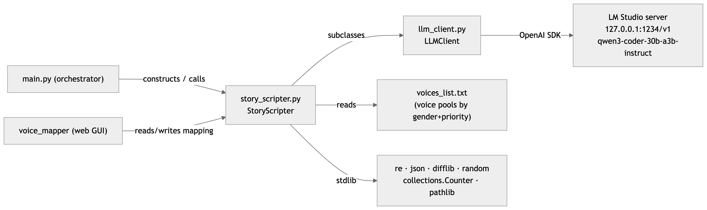
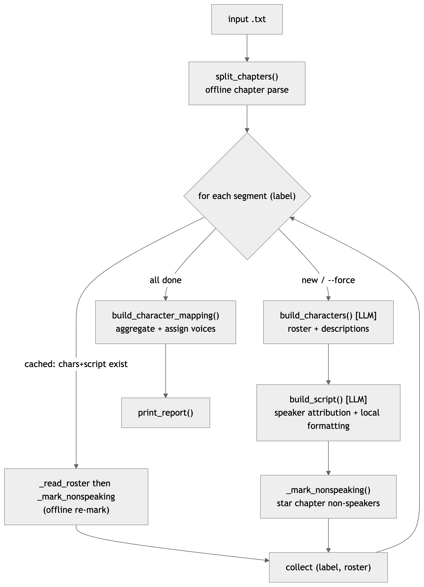
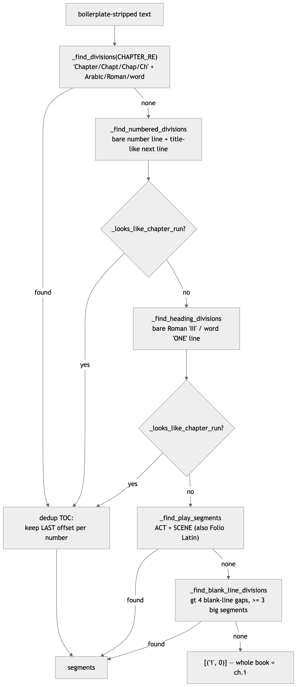
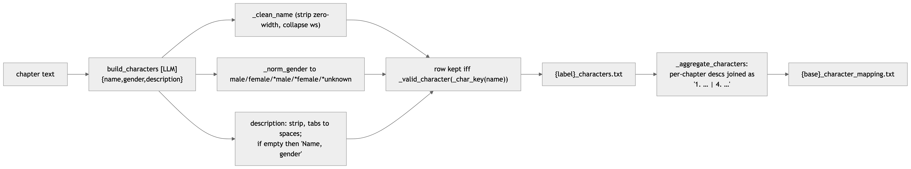
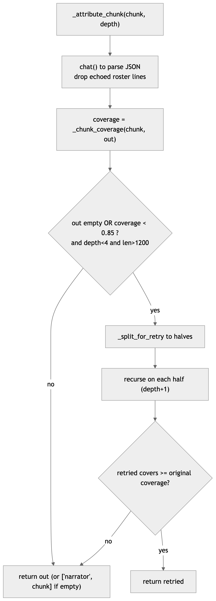
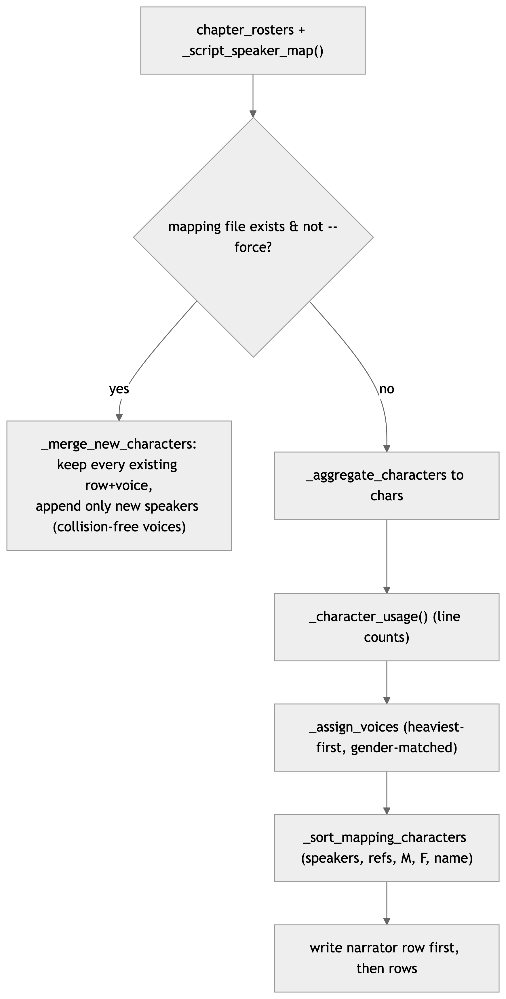
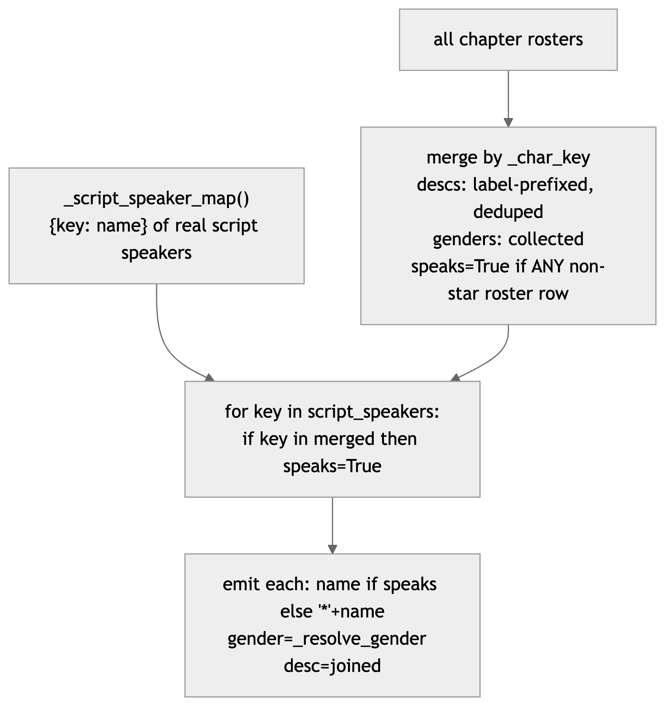
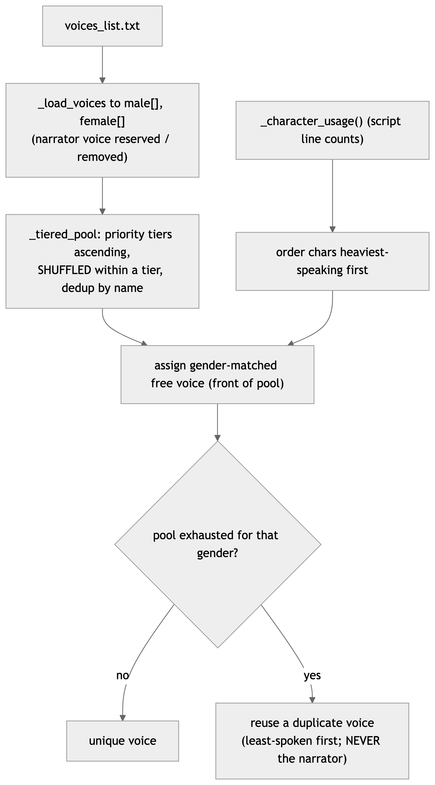
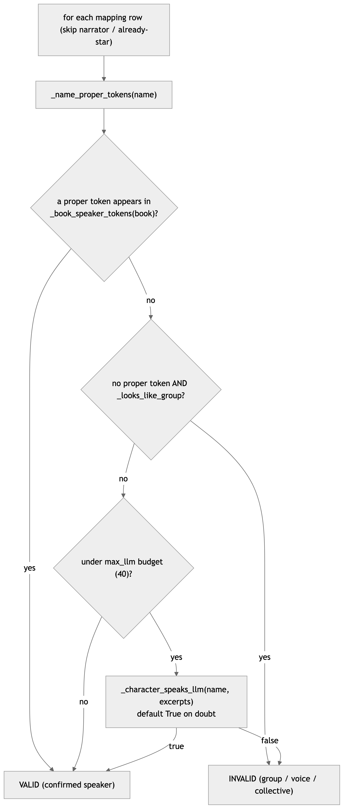

# `story_scripter.py` — Architecture & Internals

Deep reference for the core module that turns a plain ASCII book into per‑chapter
**character rosters**, per‑chapter **speaker‑attributed scripts**, and a single
**character → voice mapping**. Audio (WAV/MP3) is *not* produced here — that is the
job of `vb/` and `main.py`. This document covers only `story_scripter.py`: how it
parses chapters, extracts characters and their descriptions, attributes every
speaking part, and assembles the voice mapping.

> Companion docs: `ARCHITECTURE.md` (whole system), `SETUP_AND_RUN.md` (install/run),
> `README.md` (quick tour). This file is the **implementation‑level** reference for
> the parser/attributor.

---

## 1. Purpose & responsibilities

`StoryScripter` (a subclass of `LLMClient`) is a resumable batch processor. Given
one `.txt` file it produces, next to that file:

| Artifact | Produced by | Contents |
|---|---|---|
| `{base}_{label}.txt` | `split_chapters` (offline) | the raw text of one chapter/segment |
| `{base}_{label}_characters.txt` | `build_characters` (LLM) → `_mark_nonspeaking` (offline) | roster: `name ⇥ gender ⇥ description` |
| `{base}_{label}_script.txt` | `build_script` (LLM + local formatting) | ordered `⇥ speaker ⇥ text` lines |
| `{base}_character_mapping.txt` | `build_character_mapping` (offline) | one row per character with an assigned voice |

`label` is `"3"` for novel chapter 3, `"1.2"` for a play's act 1 / scene 2.

**Design split** — the LLM is used only where judgement is needed (who is a
character, who speaks each line, does X have dialogue). Everything mechanical
(finding chapters, sentence/line formatting, dedup, gender resolution, voice
assignment, `*` marking, validation math) is **deterministic and offline**, so
validation is reproducible and re‑runs are cheap.

---

## 2. Dependencies



<sub>*Diagram source: [`images/deps.mmd`](images/deps.mmd) — regenerate with `mmdc`.*</sub>

- **`LLMClient`** (`llm_client.py`): a thin OpenAI‑compatible wrapper. Key method
  `chat(prompt, system=…, temperature=0.2, max_tokens=…)` returns the assistant
  text with any `<think>…</think>` block stripped, and **raises** if the model
  truncates on reasoning before emitting content (so callers learn the budget was
  too small). `test_connection()` never raises — it returns `False` if the server
  is down. Default model `qwen3-coder-30b-a3b-instruct` (non‑reasoning → fast).
- **`voices_list.txt`** (module directory): the TTS voice catalogue, tab‑delimited
  with a header `NAME ⇥ GENDER ⇥ PRIORITY ⇥ LANG ⇥ VOICE ID ⇥ MODEL`. Only
  `NAME`, `GENDER`, `PRIORITY` are consumed here; `PRIORITY 0` = never assigned.
- **stdlib only** otherwise. No audio/ffmpeg dependency in this module.

---

## 3. End‑to‑end pipeline (`process`)



<sub>*Diagram source: [`images/pipeline.mmd`](images/pipeline.mmd) — regenerate with `mmdc`.*</sub>

`process(force=False)` (`story_scripter.py:211`) is the entry point:

1. `if not self.ok: return False` — bail if the LLM server never came up.
2. `split_chapters()` → `[(label, path), …]`.
3. For each segment: **resume‑skip** if both `_characters.txt` and `_script.txt`
   already exist (still re‑runs the offline `_mark_nonspeaking` so old projects
   gain `*` marks), else `build_characters` → `build_script` → `_mark_nonspeaking`.
   Each chapter's `(label, roster)` is accumulated.
4. `build_character_mapping(chapter_rosters, force=force)`.
5. `print_report()` (per‑file timings).

Atomicity underpins resumability: every file is written by `_atomic_write`
(`.part` temp + `os.replace`), so a file exists **only when fully written** — a
crash mid‑chapter never leaves a half file that resume would trust.

---

## 4. Stage 1 — Chapter parsing (ASCII, no LLM)

The heart of the "book parsing" the request asks about. Entirely offline and
deterministic (`planned_labels` reuses it so validation can predict labels
without touching the LLM or writing files).

### 4.1 `split_chapters` (`:261`)

```
read (utf-8-sig, strips BOM)
  → _strip_boilerplate      # cut Project Gutenberg header/footer
  → _detect_segments        # [(label, start_offset), …]
  → for each segment: slice text[start:next_start], .strip(),
        trim trailing "\nPost-Script…", write {base}_{label}.txt
  → if 1 chapter & book > 120 KB: _warn_if_chapters_missed (LLM, warn-only)
```

`_strip_boilerplate` (`:516`) drops everything before `*** START OF TH… ***` and
after `*** END OF TH… ***` when present.

### 4.2 The detection cascade — `_detect_segments` (`:314`)

**First match wins.** Each tier is guarded so a weaker signal can't over‑segment.



<sub>*Diagram source: [`images/chapter-detection.mmd`](images/chapter-detection.mmd) — regenerate with `mmdc`.*</sub>

**Tier 1 — labeled chapters (`CHAPTER_RE`, `:59`).** Matches a line that *starts*
with `chapter|chapt|chap|ch` then a numeral. The numeral group accepts:
- Arabic `\d+`
- Roman `[ivxlcdm]+`
- English cardinal word via `_WORD_NUM_FRAG` (`one`…`ninety‑nine`, incl.
  `twenty-three`; units listed longest‑first so `sixteen` beats `six`).
Anchored to line start, so `"In chapter 3 we…"` inline references are ignored.

**Tier 2 — bare number + title (`_find_numbered_divisions`, `:407`).** For ebooks
that mark chapters as a lone number line (`"2"`) whose next non‑blank line is
title‑like (1–8 words, starts with a capital/quote/`_TITLE_START_RE`). Segment
begins *at the number line* so the chapter keeps its number + title.

**Tier 3 — bare heading lines (`_find_heading_divisions`, `:383`).** A line that
is *only* an uppercase Roman numeral (`III`) or a cardinal word (`ONE`,
`TWENTY-THREE`) — `_ROMAN_LINE_RE` / `_WORD_LINE_RE`. No title line required.

Tiers 2 & 3 are gated by **`_looks_like_chapter_run`** (`:439`): accept only if
≥3 markers, the first is 0 or 1, and the numbers are strictly increasing (deduped
by number, ordered by file position). This rejects stray page numbers.

**Tier 4 — plays (`_find_play_segments`, `:470`).** Splits on `ACT_RE` +
`SCENE_RE` → labels `"act.scene"` (e.g. `1.1`). Handles modern (`ACT I`,
`Scene 2`) and First‑Folio Latin (`Actus Primus`, `Scoena Prima`) via `_NUMERAL`
+ `_WORD_NUMERALS`. Also catches a scene printed inline on the ACT line
(`SCENE_INLINE_RE`). If acts but no scenes → act‑only labels (`"1"`, `"2"`).

**Tier 5 — blank‑gap split (`_find_blank_line_divisions`, `:354`).** Last resort
for books separated only by whitespace: break at every run of `> BLANK_CHAPTER_GAP`
(4) blank lines, merge any fragment `< MIN_CHAPTER_WORDS` (200) into the previous
one, and **only** return a result if ≥3 sizeable segments remain (else it's
continuous prose → one chapter).

**Tier 6 — fallback.** `[("1", 0)]`: the whole book is chapter 1. When the book is
large (>120 KB) yet fell through to a single chapter, `_warn_if_chapters_missed`
asks the LLM to describe the chapter delimiter and **warns only** — detection is
never changed by the model, keeping it deterministic.

### 4.3 TOC de‑duplication

A table of contents lists the same chapter numbers that appear again as body
headings. `_detect_segments` keeps the **last** offset for each number
(`last_start[num] = start`), so the body heading wins and the TOC entry is
discarded.

### 4.4 Numeral parsing — `_parse_numeral` (`:526`)

Converts a heading numeral to `int` (or `None`): Arabic (`isdigit`), Latin
ordinal / English small‑cardinal via `_WORD_NUMERALS`, full English cardinal via
`_parse_word_number` (1–99), else Roman numeral (subtractive scan with
`_ROMAN_VALUES`).

---

## 5. Stage 2 — Character roster & descriptions (LLM)

### 5.1 `build_characters` (`:553`)

Sends the **whole chapter** to the model with a strict system prompt and writes
`{base}_{label}_characters.txt` as `name ⇥ gender ⇥ description` rows.

The system prompt enforces the rules that make descriptions reliable:
- Return **only** a JSON array of `{name, gender, description}` — no prose/fences.
- **Gender is mandatory and binary**: `male`/`female` when determinable (people
  *and* animals); otherwise a *best guess* marked with a leading `*` (`*male` /
  `*female`). `"unknown"` is forbidden — the model must commit.
- **Every character must have a non‑empty description**; if nothing else is known,
  use the name + gender.

### 5.2 How the description survives to the mapping



<sub>*Diagram source: [`images/description-flow.mmd`](images/description-flow.mmd) — regenerate with `mmdc`.*</sub>

Per‑character safeguards in `build_characters`:
- `_clean_name` (`:1031`) strips zero‑width / BOM / bidi chars (`_INVISIBLE_RE`)
  and collapses whitespace — these otherwise break case‑insensitive dedup.
- `_norm_gender` (`:613`) normalizes to `male`/`female`/`*male`/`*female`, or
  `*unknown` only if truly unparseable.
- Description: `.strip()`, tabs → spaces (tab is the field separator); a blank
  description is backfilled with `"{name}, {gender}"` so **no row is ever blank**.
- The row is kept only if `_valid_character(_char_key(name))` — filtering pronouns
  / `narrator` / stray single letters (`_NON_CHARACTER_NAMES`, `:138`).

**Aggregation across chapters** (`_aggregate_characters`, §8) concatenates each
chapter's contribution as a label‑prefixed run: `"1. … | 4. …"`, so the mapping
description shows a character's arc across the book (see the `Merlin` row in the
King Arthur mapping, spanning chapters 1‑13). Gender is resolved by
`_resolve_gender` (`:1054`): an explicit stated gender beats any guessed one; a
majority guess (`*`‑prefixed) is kept only if nothing explicit exists.

---

## 6. Stage 3 — Script attribution (LLM) + local formatting

### 6.1 `build_script` (`:1182`)

```
roster → roster_str (bullet list) + _build_roster_index (name/first-token → canon)
text → _chunk(max_chars=6000)          # paragraph-packed chunks
for each chunk:
    segments = _attribute_chunk(chunk, roster_str)     # [(speaker, text), …]
    for (speaker, content) in segments:
        speaker = _canon_speaker(speaker, roster_index)
        if narrator:  emit lines from _narrator_lines(content)   # _flow_lines punctuation flow
        else:         strip quotes, collapse ws → one "⇥ speaker ⇥ spoken" line
atomic_write {base}_{label}_script.txt
```

Output line shape (leading empty meta column, like the mapping): `⇥ speaker ⇥ text`.

### 6.2 Chunking — `_chunk` (`:1496`)

Packs whole paragraphs (split on blank lines) into ≤ `6000`‑char chunks. Sized so
the model reliably emits well‑formed JSON and each call is ~1–2 min; larger chunks
caused truncated JSON on dialogue‑heavy chapters.

### 6.3 `_attribute_chunk` — the LLM segmenter with self‑healing retry (`:1271`)

The system prompt tells the model to return an **ordered** JSON array of
`{speaker, text}` covering the passage verbatim, and encodes the project's
dialogue conventions:
- Dialogue may use double/single/curly quotes, a **leading em‑dash (—)**, a
  `Name:` script format, or **no quote marks at all** — all count as spoken.
- Quoted speech embedded mid‑narration must be **split into its own speaker
  entry** (with a worked `“Oh my paws!”` example).
- **Internal thoughts** (italics, or tagged `thought`/`wondered`) are **not**
  spoken → attributed to `narrator`.
- Emit only the spoken words (no quotes, no `he said`); never summarize/reorder.



<sub>*Diagram source: [`images/attribute-retry.mmd`](images/attribute-retry.mmd) — regenerate with `mmdc`.*</sub>

- **`_chunk_coverage`** (`:1342`): `difflib.SequenceMatcher` over normalized word
  tokens — fraction of the chunk's words preserved in the attributed output.
- **Retry trigger**: unparseable/empty JSON **or** coverage `< MIN_CHUNK_COVERAGE`
  (0.85). Smaller spans omit less content, so recursion (max depth 4, min span
  1200 chars) recovers dropped sentences. A retry is kept only if it covers **at
  least as well** — a retry never regresses.
- **Last resort**: a small unparseable span is kept as one `narrator` line, so a
  bad call costs a paragraph, not a chapter.

### 6.4 Speaker canonicalization — `_canon_speaker` (`:1251`)

Resolves a model‑emitted speaker name to a roster name so lines merge correctly:
1. empty/`narrator` → `"narrator"`;
2. exact match against `_build_roster_index` (full name **or** first token, e.g.
   `"julia"` → `"julia bertram"`);
3. **token‑subset** match (`"captain drucker"` → `"captain isidaore drucker"`);
4. otherwise the verbatim lowercased speaker (an unlisted but real speaker).

### 6.5 Line flow — minimizing pauses (offline, deterministic)

Every script line becomes one WAV, and each WAV boundary is an audible pause when
chapters are stitched. To keep narration contiguous the pipeline packs text into
fewer, longer lines that break on natural punctuation:

- **`_flow_lines(text, max_words=MAX_LINE_WORDS)`** — the single word‑accumulation
  rule. It appends words to a line and ends the line when it has at least
  **`PARSE_WORDS_AFTER_MAX` (16)** words *and* the current word ends with a break
  char — `.` `?` `!` `,` or a closing quote (`_LINE_BREAK_CHARS`) — otherwise it
  **force‑breaks at `MAX_LINE_WORDS` (50)**. Punctuation before word 16 is ignored,
  so short sentences merge into one line landing near the **`OPTIMUM_LINE_WORDS`
  (25)** ideal. Terminal punctuation is **kept** (it is what makes Voicebox render
  the natural pause). A trailing `.` on a title abbreviation (`Mr.`, `Dr.`, …) or a
  single‑letter initial (`J.`) does not end a line (`_is_abbrev`).
- **`_narrator_lines`** (`:1388`) — just `_flow_lines(text)` for a narrator segment.
- **`normalize_scripts`** (`:1460`) — the offline **reflow** pass (run once from
  `main.py` before audio). It merges **consecutive same‑speaker** rows (narrator
  runs and same‑character runs; never across different speakers), re‑flows each run
  through `_flow_lines`, and rewrites every `_*_script.txt` in place (atomic). It is
  **idempotent** — a second run changes nothing and returns 0 (the `main.py`
  audio‑skip gate depends on this) — and it improves pre‑existing scripts without
  re‑running the LLM. Returns the number of source rows that changed.

Worked example — `The dog ran into the barn, but the cat scared the dog. So the dog
barked at the cat, while the rat sat to laugh. The dog chased the rat, …` flows to
line 1 ending at the comma after `…the cat,` (first break char past word 16; the
earlier comma/period were <16 and ignored) and line 2 ending at the next period past
its own 16‑word mark.

---

## 7. Stage 4 — Non‑speaking marks (`*`), offline

### 7.1 `_mark_nonspeaking` (`:1210`)

After a chapter's script exists, this rewrites that chapter's `_characters.txt`
prefixing `*` onto any character with **no speaking part in that chapter's
script**. A character "speaks" iff it is the speaker of ≥1 non‑narrator script
line (speakers already canonicalized). Idempotent — it strips any existing `*`
first. This is *per chapter*; the aggregate `*` decision is made later.

### 7.2 The `*` marker, precisely

- **In `_characters.txt`**: `*Name` = "referenced but silent *in this chapter*".
- **In the mapping**: `*Name` = "never speaks in *any* chapter" → gets no
  voice/WAV (`load_voice_map` skips `*` rows), but is kept with its description.
- `_char_key` strips a leading `*`, so `*Foo` and `Foo` are the same character for
  dedup/lookup.
- The **narrator is never starred** (guarded everywhere).

---

## 8. Stage 5 — Aggregate mapping & voice assignment (offline)

### 8.1 `build_character_mapping` (`:636`)



<sub>*Diagram source: [`images/mapping-build.mmd`](images/mapping-build.mmd) — regenerate with `mmdc`.*</sub>

- **Full build / `--force`**: aggregate → assign voices → sort → write. Narrator
  row (`⇥ narrator ⇥ {narrator_voice} ⇥ male ⇥ Story narrator`) is always first.
- **Incremental** (file exists, no `--force`): `_merge_new_characters` (`:694`)
  preserves **every** existing row and its (possibly hand‑edited) voice, appending
  only aggregated speakers whose key isn't already present, with voices chosen to
  avoid those already in use (`taken=`). Nothing is dropped or reassigned.
- **`rebuild_character_mapping`** (`:734`): a clean regenerate that **preserves
  voices by character key** (incl. the narrator's), assigns fresh collision‑free
  voices only to unmatched characters, and re‑derives every gender/description
  from the rosters. Use this to repair a mapping with blank/duplicate rows.

### 8.2 `_aggregate_characters` — dedup + the speaks decision (`:954`)

The authority rules (as currently implemented):



<sub>*Diagram source: [`images/aggregate-speaks.mmd`](images/aggregate-speaks.mmd) — regenerate with `mmdc`.*</sub>

- A character is a **speaker** if it has a non‑`*` roster row in any chapter **or**
  it actually has a line in some chapter script. **Scripts are authoritative** —
  `_script_speaker_map` (`:937`) collects every real script speaker, and a roster
  character found there is force‑unstarred even if the roster mismarked it (the
  attributor sometimes gives a line to a character it didn't list in that
  chapter's roster; without this fix that character would be starred and lose its
  audio).
- **Script‑only names are deliberately ignored** — they are overwhelmingly generic
  roles/groups/variants (`knight`, `people`, `voice`, `sir lancelot du lake`,
  `speaker`) that the curated roster excludes; injecting them would flood the
  mapping with junk rows.
- A character with a description that **never** speaks anywhere is kept, its name
  `*`‑prefixed (full‑roster behaviour: complete cast, no audio for non‑speakers).
- Gender via `_resolve_gender`; description = label‑prefixed join, else the
  `"name, gender"` fallback.

### 8.3 Voice assignment — `_assign_voices` (`:1123`)



<sub>*Diagram source: [`images/voice-assignment.mmd`](images/voice-assignment.mmd) — regenerate with `mmdc`.*</sub>

- **`_load_voices`/`_tiered_pool`** (`:1071`, `:1103`): read `voices_list.txt`,
  build per‑gender pools ordered by `PRIORITY` (1 = first tier; `0` = excluded),
  **shuffled within each tier** for variety, deduped by name (kept at its lowest
  tier). The narrator's voice is removed from the male pool (reserved).
- **Heaviest‑first**: characters are ordered by `_character_usage` (their total
  script line count) so the **most‑spoken characters get unique voices**. The
  **narrator's voice is reserved** and never assigned to a character. Once a
  gender's pool is fully allocated, remaining characters **reuse a duplicate**
  voice — preferring the least‑spoken character's voice, so a major character's
  voice is the last to be doubled up.
- Gender routing: `female` → female pool; everything else → male pool. `taken=`
  seeds already‑used voices for collision‑free incremental adds.
- **Unknown‑gender inference** (`_resolve_unknown_genders`, run just before
  `_assign_voices` in every build path): a character still resolved to `*unknown`
  gets a gender from, in order, its **description** words (`_gender_from_text` —
  pronouns/gendered nouns), its **name** title (`_gender_from_name` — Sir/Lady/King/
  Queen…), then the **LLM** (`_gender_llm`, bounded, best‑effort), so it routes to
  the right voice pool. Stored as a guess (`*male`/`*female`); undecidable → `*male`.
  The extraction prompt already forces male/female, so this is a safety net.

**Voices for unmapped speakers** — `assign_voices_to_unmapped(target)` (offline, run
from `main.py` before audio) reconciles the mapping to the scripts: any script
speaker with no voiced row is assigned a **real gender‑matched voice** via
`_assign_voices` (unique if one is free, else a duplicate) — **never the narrator's
voice, which stays reserved** — filling a blank‑voice row or appending one, so no
line is silently dropped. `*`‑starred (deliberately non‑speaking) characters are left
silent. Idempotent (0 and no write when every speaker is already voiced). The audio
side (`resolve_chapter_cues`) still narrates a speaker only as an absolute last
resort (no voice at all in an un‑reconciled play‑only flow).

### 8.4 Mapping row order — `_sort_mapping_characters` (`:1012`)

Narrator first, then sorted by `(is_starred, gender_order[male<female<other],
name)`. So the file reads: narrator → male speakers → female speakers → starred
non‑speakers, each block alphabetical.

---

## 9. Optional book cross‑check (speaker validation)

`validate_character_mapping_file_with_story` (`:835`) is a **stricter, opt‑in**
pass that flags mapped characters with no *quoted dialogue in the original book*
(distinct from the script‑based `*` above). **Not auto‑applied** — it can
false‑flag real script speakers (e.g. `Sir Tor`). Invoke via `_run_speaker_cleanup`
manually when wanted.



<sub>*Diagram source: [`images/book-crosscheck.mmd`](images/book-crosscheck.mmd) — regenerate with `mmdc`.*</sub>

- **`_book_speaker_tokens`** (`:786`): brute‑scan the raw book for `"<verb> Name"`
  / `"Name <verb>"` (with `_ATTR_VERBS`, which **excludes `thought`** — internal
  monologue isn't spoken) and script‑format `Name:` lines; collect confirmed
  speaker tokens (titles stripped via `_NAME_TITLES`).
- **`_looks_like_group`** (`:823`): a name made only of role/collective/quantifier
  words (`_GROUP_WORDS`, `_QUANTIFIER_WORDS`) with no proper name is a group —
  *unless* it starts with a personal title (`King of the Hundred Knights` is a
  titled individual, not a group).
- **`_character_speaks_llm`** (`:874`): gathers up to 3 ±200‑char excerpts around
  the name and asks `{"speaks": true|false}`, convention‑aware (quotes/em‑dash/
  `Name:`, excludes thoughts). **Defaults to keep** on any doubt/error/name‑not‑
  found — conservative so real characters are never removed.
- **`apply_mapping_speaker_cleanup`** (`:905`): prefixes `*` on the flagged names
  (never narrator/already‑`*`), atomic, re‑sorts, returns the count.

---

## 10. Reverse validation — script vs. original chapter

`check_script` (`:1542`) / `check_all` (`:1624`) grade a produced script against
its source chapter (offline). It reconstructs the script text (all speaker lines
in order), word‑aligns to the chapter with `difflib`, and reports:

- **coverage** = matched / original words (how much survived; ≥ `COVERAGE_PASS`
  0.90),
- **fidelity** = matched / script words (how little was hallucinated; ≥
  `FIDELITY_PASS` 0.90),
- **missing / extra** runs ≥ `MIN_DIFF_RUN` (4) words. Missing runs built around a
  `SPEECH_VERBS` word or a `chapter/act/scene` heading are classified as *expected*
  dropped tags (`missing_tags`), not lost content.

`PASS` requires both thresholds and zero malformed lines.

---

## 11. Data formats (on disk)

All files are tab‑delimited UTF‑8. `⇥` = TAB.

**`{base}_{label}_characters.txt`** — `name ⇥ gender ⇥ description`
```
Don Jose⇥male⇥A notorious bandit in Andalusia… blue eyes. He is proud, sullen…
The Old Woman⇥*female⇥An elderly woman who lives at the Venta del Cuervo…
*Jose-Maria⇥*male⇥A famous brigand… (referenced but does not speak this chapter)
```

**`{base}_{label}_script.txt`** — `<empty> ⇥ speaker ⇥ text` (ordered)
```
⇥narrator⇥I had always suspected the geographical authorities did not know…
⇥Don Jose⇥Follow me, señor.
```

**`{base}_character_mapping.txt`** — `<empty> ⇥ character ⇥ voice ⇥ gender ⇥ description`
```
⇥narrator⇥Adam⇥male⇥Story narrator
⇥Vortigern⇥Daniel⇥male⇥1. Usurper king of Britain…
⇥Merlin⇥Fable⇥*male⇥1. Young boy with mysterious parentage… | 2. … | 13. …
⇥*Ambrosius⇥Puck⇥*male⇥1. Son of Constantine… (never speaks → no WAV)
```
The leading empty column is a reserved voice‑meta slot; `*` on the **character**
column = non‑speaker, `*` on the **gender** column = guessed gender.

**`voices_list.txt`** — `NAME ⇥ GENDER ⇥ PRIORITY ⇥ LANG ⇥ VOICE ID ⇥ MODEL`
(only NAME/GENDER/PRIORITY consumed; `PRIORITY 0` never assigned).

---

## 12. Method map (by responsibility)

| Area | Methods |
|---|---|
| Orchestration | `process`, `print_report` |
| Chapter parse | `split_chapters`, `_detect_segments`, `_find_divisions`, `_find_numbered_divisions`, `_find_heading_divisions`, `_find_play_segments`, `_find_blank_line_divisions`, `_looks_like_chapter_run`, `_strip_boilerplate`, `_parse_numeral`, `planned_labels`, `_warn_if_chapters_missed` |
| Roster (LLM) | `build_characters`, `_norm_gender`, `_read_roster` |
| Script (LLM) | `build_script`, `_attribute_chunk`, `_chunk`, `_chunk_coverage`, `_split_for_retry`, `_canon_speaker`, `_build_roster_index`, `_extract_json` |
| Formatting | `_narrator_lines`, `_flow_lines`, `_is_abbrev`, `normalize_scripts` |
| Non‑speaking | `_mark_nonspeaking`, `_script_speaker_map` |
| Mapping | `build_character_mapping`, `_merge_new_characters`, `rebuild_character_mapping`, `_aggregate_characters`, `_resolve_gender`, `_sort_mapping_characters`, `_sort_mapping_rows`, `_mapping_sort_key` |
| Voices | `_load_voices`, `_tiered_pool`, `_assign_voices`, `_character_usage`, `assign_voices_to_unmapped` |
| Gender | `_resolve_gender`, `_resolve_unknown_genders`, `_gender_from_text`, `_gender_from_name`, `_gender_llm` |
| Book cross‑check | `validate_character_mapping_file_with_story`, `_book_speaker_tokens`, `_name_proper_tokens`, `_looks_like_group`, `_character_speaks_llm`, `apply_mapping_speaker_cleanup`, `_run_speaker_cleanup` |
| Reverse validation | `check_script`, `check_all`, `_print_check`, `_norm_tokens` |
| Utility | `_clean_name`, `_char_key`, `_valid_character`, `_label_key`, `_atomic_write` |

---

## 13. Tunable constants

| Constant | Value | Meaning |
|---|---|---|
| `PARSE_WORDS_AFTER_MAX` | 16 | after this many words, end a line at the next punctuation |
| `OPTIMUM_LINE_WORDS` | 25 | natural/ideal line length the flow rule produces |
| `MAX_LINE_WORDS` | 50 | force a line break here if no punctuation break was found |
| `NARRATOR_VOICE` | `Michael` | default narrator voice (reserved; never on a character) |
| `BLANK_CHAPTER_GAP` | 4 | blank lines that count as a chapter break |
| `MIN_CHAPTER_WORDS` | 200 | minimum body between blank‑gap breaks |
| `COVERAGE_PASS` / `FIDELITY_PASS` | 0.90 | reverse‑validation thresholds |
| `MIN_DIFF_RUN` | 4 | min word run to report as missing/extra |
| `MIN_CHUNK_COVERAGE` | 0.85 | attribution retry trigger |
| `max_llm` (validate) | 40 | LLM budget per book for speaker cross‑check |
| `_chunk` `max_chars` | 6000 | attribution chunk size |

---

## 14. Key invariants

1. **Deterministic parsing** — chapter detection, formatting, dedup, gender
   resolution, voice assignment and both validators are offline; the LLM is used
   only for roster extraction, line attribution, and the optional speaker check
   (and a warn‑only chapter sanity‑check). `planned_labels` predicts labels with
   zero side effects.
2. **Atomic + resumable** — every write is `.part` → `os.replace`; a completed
   file means "this stage is done", so `process` safely skips finished chapters.
3. **Narrator is sacred** — always the first mapping row, never `*`‑marked, its
   voice reserved out of the assignable pools.
4. **Scripts are the source of truth for "speaks"** — the `*` marker and voice
   assignment ultimately follow what actually appears in the scripts (which drive
   audio), not merely the roster.
5. **Conservative validation** — the book cross‑check never removes on doubt and
   is opt‑in; nothing silently deletes a real character.
